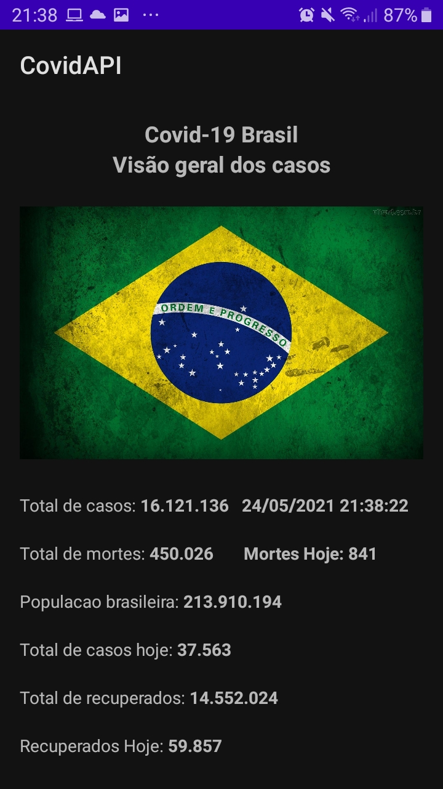

## Projeto - Aplicativo de dados do Covid-19 - Android Studio
### Centro Paula Souza - Fatec Ferraz - Curso de Análise e Desenvolvimento de Sistemas
### Disciplina – Programação para dispositivos moveis – Prof. Marcos Vasconcelos

- Diego Fernandes Lins

### Resumo
Um aplicativo usando android studio e Kotlin que acessa a internet e faz chamado a uma API para trazer informações sobre o Covid-19 no Brasil, nesse aplicativo trazemos em tempo real as mortes, recuperados e total de casos no dia.

### Tecnologias
- Android Studio
- Kotlin
- API disease.sh Covid-19: https://disease.sh/docs/#/

### Imagem demosntrativa

